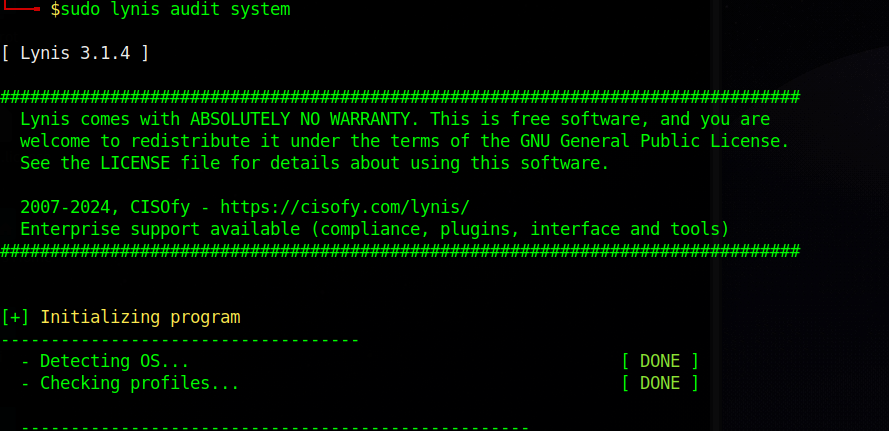
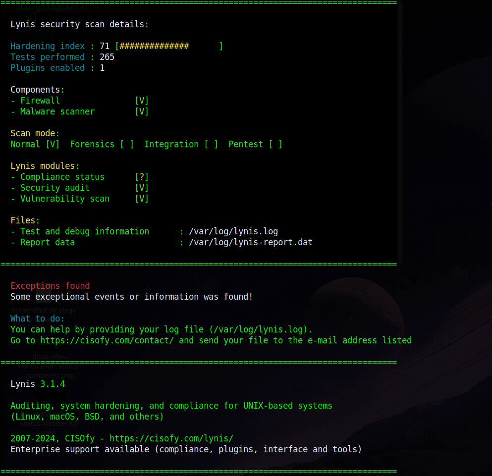

# 07 – System Auditing and Lynis

Hardening without auditing is mostly guesswork.

You need a way to review the system and identify obvious weak points, stale packages, exposed services, and poor defaults.

For Debian and Ubuntu systems, Lynis is a practical baseline auditing tool.

## 1. What Lynis is good for

Lynis is useful for:

- surfacing obvious configuration issues
- identifying stale or weak defaults
- highlighting unnecessary exposure
- giving you a second pass after changes
- helping structure reviews on workstations and small servers

It is not a substitute for understanding the system.

Use it to find blind spots, not to worship a score.

## 2. Install Lynis

Install the package:

```bash
sudo apt-get update
sudo apt-get install lynis
````

## 3. Run a full audit

Run a local audit:

```bash
sudo lynis audit system
```



This will inspect a wide range of system settings and generate findings, suggestions, and warnings.



## 4. How to interpret results

Treat the output as triage, not gospel.

A useful way to think about Lynis results is:

### High-value findings

Look first for:

* exposed services you forgot about
* outdated packages
* weak authentication posture
* missing firewalling
* weak mount or kernel defaults
* unnecessary software components

### Lower-value findings

Some output will be context-dependent or less important for your specific host role.

Do not waste time chasing “better looking” results if the underlying host role is still messy.

## 5. Use it before and after changes

A strong workflow is:

1. run Lynis before major hardening changes
2. apply a small set of changes
3. run Lynis again
4. compare what improved and what still matters

This is far more useful than running it once and forgetting it.

## 6. Pair Lynis with direct inspection

Do not let Lynis replace direct checks.

Pair it with:

```bash
ss -tulpen
systemctl list-unit-files --type=service --state=enabled
findmnt -o TARGET,SOURCE,FSTYPE,OPTIONS
sudo ufw status verbose
```

That way you are combining:

* automated audit output
* service visibility
* network visibility
* mount visibility
* firewall visibility

## 7. Practical mindset

When Lynis flags something, ask:

* does this fit the role of the machine
* is this a real exposure or just a generic suggestion
* what is the correct fix on Debian or Ubuntu
* how will I verify the fix afterward

That is how you keep auditing useful.

## Bottom line

Lynis is valuable because it helps reveal what you missed.

It becomes even more valuable when you treat it as part of an ongoing hardening loop instead of a one-time report.