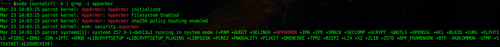

# 12 – Mandatory Access Control: AppArmor and SELinux

Traditional Unix permissions are not the whole security model.

Mandatory Access Control adds another layer by constraining what processes are allowed to do, even when normal file permissions alone would not be enough.

On Debian and Ubuntu, the default MAC path is usually AppArmor.

SELinux matters conceptually and is standard on other Linux families, but it is not the default baseline on Debian and Ubuntu.

Do not try to run both casually.

## 1. AppArmor on Debian and Ubuntu

### 1.1 Why it matters

AppArmor can reduce the damage a compromised or misbehaving process can do by applying policy to that program.

That makes it especially relevant for:

- exposed services
- administrative tools
- complex userland applications
- systems where process confinement matters more than raw convenience

### 1.2 Check AppArmor status

Inspect current AppArmor status:

```bash
sudo aa-status
````


This helps show:

* whether AppArmor is enabled
* how many profiles are loaded
* which profiles are enforcing
* which profiles are in complain mode

If the tooling is missing, install it:

```bash
sudo apt-get install apparmor apparmor-utils
```

### 1.3 Profile location

AppArmor profiles are typically stored under:

```text
/etc/apparmor.d/
```

This is where you review or manage profile files.

### 1.4 Enforce and complain modes

Set a profile to enforce mode:

```bash
sudo aa-enforce /etc/apparmor.d/usr.sbin.sshd
```

Set a profile to complain mode:

```bash
sudo aa-complain /etc/apparmor.d/usr.sbin.sshd
```

Use complain mode when testing or troubleshooting policy behavior.

Use enforce mode when you understand the policy and want the restrictions to apply.

### 1.5 Reload a profile

After editing a profile, reload it:

```bash
sudo apparmor_parser -r /etc/apparmor.d/<profile-name>
```

Then restart the related service if appropriate.

Example:

```bash
sudo systemctl restart ssh
```

### 1.6 Operational guidance

For Debian and Ubuntu systems:

* keep AppArmor enabled unless you have a real reason not to
* review what is already enforced
* avoid disabling profiles casually because they are inconvenient
* treat exposed services as the highest-value candidates for confinement

## 2. SELinux context

SELinux is the default MAC framework in other Linux families such as RHEL, Fedora, and related systems.

Typical SELinux status commands are:

```bash
getenforce
sestatus
```

That is useful context, but this repository is not built around SELinux-first policy management.

On Debian or Ubuntu, AppArmor is the normal baseline and should remain the primary focus here.

## 3. Logging and diagnostics

For AppArmor-related messages, review kernel or journal output:

```bash
sudo journalctl -k | grep -i apparmor
```



or:

```bash
sudo dmesg | grep -i apparmor
```

MAC frameworks are only useful if you actually review what they are blocking or complaining about.

## Bottom line

Mandatory access control is one of the clearest ways to move beyond basic Unix permissions.

For Debian and Ubuntu, that usually means understanding and keeping AppArmor rather than pretending it is harmless background noise.
